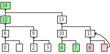

> Source: https://eprint.iacr.org/2019/611.pdf
# 7 Appendix

## 7.1 Batch deletion process

The following is a description of the batch deletion process. While the single element deletion process is sufficient and can be invoked repeatedly, it is inefficient to do so. When many deletions occur simultaneously we can significantly reduce the number of hash operations needed to remove elements from the accumulator by batching the deletions.

Similar to the DeleteOne() function, the process for deleting many elements operates a row at a time, climbing from the bottom to the top of the forest. At each row, the same phases are followed. The data operated on at each row, includes the known hashes and their positions, as well a list of which locations to delete. The phases are, in order: “Twin”, or twin extraction, “Swap”, or sibling swapping, “Root”, promoting a node to or demoting a node from a root position, and “Climb”, ascending to the next row up. These 4 phases are described with accompanying diagrams. In the following diagrams, green nodes are nodes which are always known, as they are or were tree roots. Pink nodes are nodes which are being deleted.

## 7.2 Twin

While the twin step is optional, we can save time from the next step by immediately dealing with “twin” deletions; we define a twin deletion as a deletion where both the left and right sibling have been deleted. If we have a sorted list of locations to be deleted, a simple way to find these is to check if the next deletion is equal to the current deletion bitwise or’ed with 1. If so, we can remove both “twins” from the deletion list, and add the parent position to the next higher row of deletions to process.

> Figure 5: Twin phase; nothing moves, and 4 is marked for deletion.

## 7.3 Swap

While there are 2 or more deletion positions left in the list, we iterate through them. Call the two positions deletionA and deletionB.

Move the hash at deletionB ⊕ 1 to deletionA. When moving a node, all the node’s children move with it. The parent of deletionB is added to the deletion list for the next row, and both deletionA and deletionB are removed from the current list. Note that in all cases we know the hash at deletionB⊕1, as it is the sibling of something being deleted (or the sibling of a parent of something being deleted) and thus is given to us in the inclusion proof.

> Figure 6: Swap phase; deletionA is 1, deletionB is 2. 3 moves to 1, and 5 is marked for deletion.

## 7.4 Root

If there are an even number of deletions on a row, the twin and swap phases will finish with no unpaired deletions, and the root phase is skipped. In cases where there are an odd number of deletions, however, the swap phase will finish with a single deletion remaining in the list. This final deletion is handled by the root phase.

For every row in the forest, there either is or is not a tree with a root at that height. For example, in the forest of 133 leaves, there is a root at height 0, but there is no root at height 1. There is a root at height 2, and no roots for several rows above that.

If we are on a row where a root is present, we move that root into the position of the remaining deletion, clear the deletion and are then finished with that row, adding no deletions for the next row. If a root is absent, we move the sibling of the deletion (position ⊕ 1) to the root position for this height, creating a new tree in the forest, and leaving a twin pair of deletions. We then mark the parent of the final deletion for deletion in the next row.

> Figure 7: Root phase with root present; 4 is demoted from a root to the sibling of 2.

> Figure 8: Root phase with root absent; 2 is promoted to root of the height 1 tree.

## 7.5 Climb

When the root phase has finished, the climb phase transitions between levels of the forest. All deletions will be in pairs of two deleted siblings. The parent nodes of all deleted sibling pairs are marked as deleted, and parents of nodes which moved in the swap or root phase are recomputed. When the deletion and hashing are finished, the per-row phases (starting with twin) begin on the next level up.

When the top of the forest is reached, the deletion process is finished. If a row is reached with no deletions, the process can terminate early.

> Figure 9: Climb phase; Begin a new deletion list from positions marked in the previous other 3 phases and climb to the next row.

## 7.6 Integrated batched deletion example

In this example, there are 8 leaves in a single tree. Leaves 5 and 6 are being deleted. An inclusion proof for both 5 and 6 is provided. Note that an inclusion proof for these nodes does not contain any nodes from the 2nd row, as both 10 and 11 are computable from data known in the first row.

> Figure 10: There are no twins, so first 7 is swapped with 5

> Figure 11: The bottom row is finished and 11 is marked for deletion as its children are gone. 10 is computed.

> Figure 12: On the second row, there are no twins, and we cannot swap, so we proceed directly to root.

> Figure 13: 10 becomes the root of its own tree, leaving 13 to be deleted as well.

> Figure 14: 14 is deleted as 12 becomes the root of its tree.

> Figure 15: The final forest state after deletion is complete.

